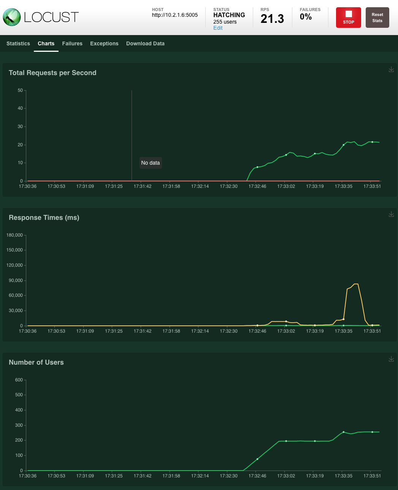

# Rasa stress testing with Locust.io

This is a basic example of how you can generate hundreds of simultaneous user connects to a Rasa instance, and send multiple conversational messages.

The original aim for this was to allow us to measure memory and CPU usage, to allow for right-sizing in our cloud environments.

#### Dependancies

* Locust.io
* Socket.io
* Python Virtual Environment

#### Setup
We recommend running in a virtual environment to keep everything clean. 

```shell script
python -m venv venv
source venv/bin/activate
```

Install the dependencies:

```shell script
 install -r requirements.txt
```

Configure your socket.io configuration in `rasa_socket.py`:

```python
ws_url = "http://10.2.1.6:5005/socket.io/"
```

Change the IP address and port of the your Rasa installation.

__For the sake of this you will want to run Rasa with --cors "*"__

Fire up Locust.io

```shell script
locust --host=http://10.2.1.6:5005 --locustfile loadtest/rasa_socket.py --port=80
```

set `--host` to be your Rasa IP and port. If you are already running a webserver locally on port 80, you'll want to move `--port` to something else.

Now browse to your local machine, based on the `--port` setting

```web2py
http://localhost
```

You'll be presented with the New Swarm window. Set the number of hosts, and hatch rate, and then click Start Swarming


You can see from the dashboard, how many users are spawned, how many connections are made, and how many failures.


All being well, you can then browse to the Charts menu and see how your swarm is doing

